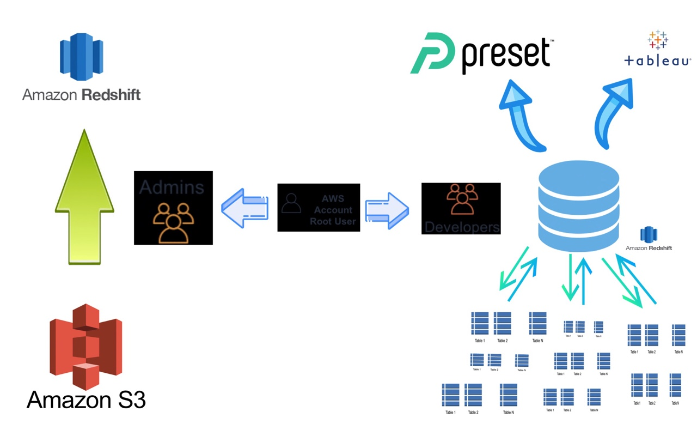
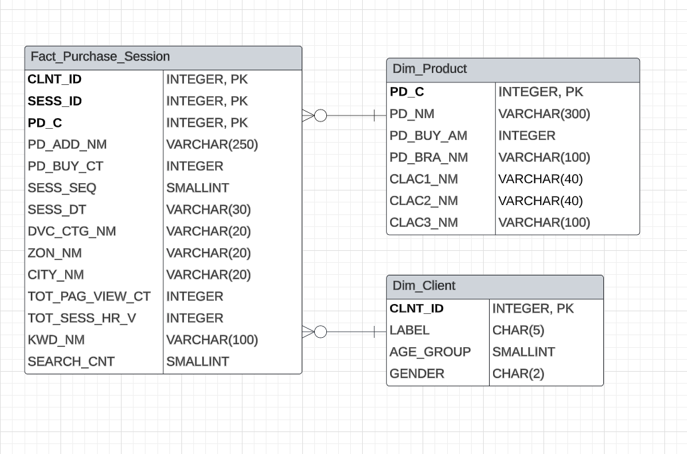

# LPOINT 로그데이터 분석 및 시각화

## 📌프로젝트 개요

- 프로젝트 명 : LPOINT 로그데이터 분석 및 시각화

## Skill Stack
- Snowflake
- AWS Redshift
- AWS S3
- AWS IAM
- Superset

## ✏️팀원 역할 분담

- 김형준 : AWS 세팅 (IAM, S3 권한, Redshift 클러스터 세팅)
- 유하준 : DW 및 DB 설계
- 한기호 : 시각화 및 대시보드
- 김수민:  시각화 및 대시보드, 기타
- 조주혜 : 시각화 및 대시보드, 기타

### AWS Setting
- AWS Setting은 아래와 같이 진행하였습니다
    - AWS IAM, S3, Redshift 클러스터 세팅
        
    - Schema Setting
        
### 데이터 웨어하우스 설계
- 데이터 웨어하우스 클러스터 내부 테이블 ERD 설계는 아래와 같이 진행하였습니다.
    

---------------

