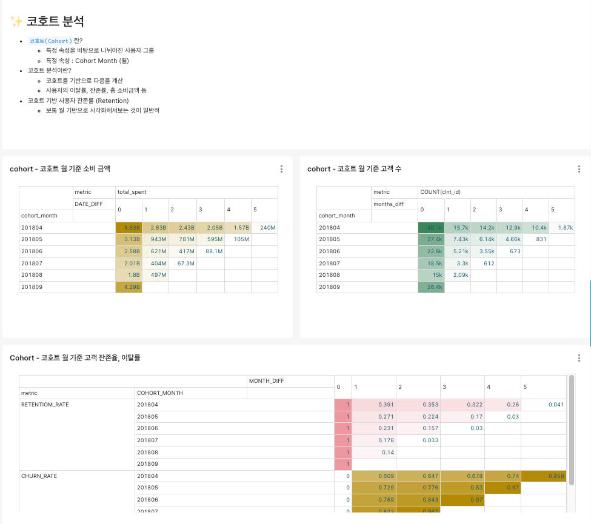

# LPOINT 로그데이터 분석 및 시각화

## 목차
- [✏️ Project Overview](#project-overview)
- [✏️ Skill Stack](#skill-stack)
- [✏️ Members Role](#members-role)
- [✏️ AWS Setting](#aws-setting)
- [✏️  Data Warehouse Architecture](#data-warehouse-architecture)
- [✏️ Visualization Dashboard Configuration](#visualization-dashboard-configuration)

## Project Overview

- 프로젝트 명 : LPOINT 로그데이터 분석 및 시각화
- 프로젝트 기간 : 2023.05.29 ~ 2023.06.02
- LPOINT Click Stream 데이터를 Redshift 및 Snowflake에 적재 후,   LPOINT 서비스를 이용한 고객이 어떤 행동을 하는지 분석하고, 이를 시각화하여 보여주는 프로젝트입니다.

## Skill Stack
- Snowflake
- AWS Redshift
- AWS S3
- AWS IAM
- Superset
 

## Members Role

- 김형준 : AWS 세팅 (IAM, S3 권한, Redshift 클러스터 세팅), 시각화 및 대시보드(DAU, Insight 시각화)
- 유하준 : DW 및 DB 설계, 시각화 및 대시보드(MAU, Cohort 시각화)
- 한기호 : 온프레미스 환경 구축, 시각화 및 대시보드(Product, Sales 시각화)
- 김수민:  온프레미스 환경 구축, 시각화 및 대시보드(Product, Sales 시각화)
- 조주혜 : 온프레미스 환경 구축, 시각화 및 대시보드(Product, Sales 시각화)

## AWS Setting
- AWS Setting은 아래와 같이 진행하였습니다
    - AWS IAM, S3, Redshift 클러스터 세팅

        

    - Schema Setting

        

## Data Warehouse Architecture
- 데이터 웨어하우스 클러스터 내부 테이블 ERD 설계는 아래와 같이 진행하였습니다.
    - Fact : Fact_Purchase_Session
    - Dimension : Dim_Product, Dim_Client 
     
    

---------------

## Visualization Dashboard Configuration
- 총 5개의 카테고리로 대시보드가 구성되었습니다 (Users, Product, Sales, Cohort, Insight)

- Users

    - MAU

        

    - DAU

        
        

- Product

    

- Sales

    

- Cohort

    

- Insight

    
